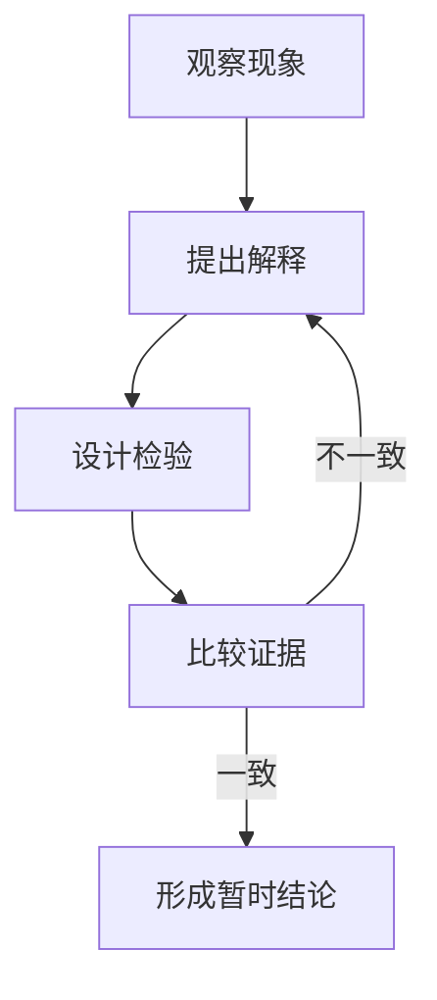

# 从观察到可检验结论

课堂上可以把一次小实验拆成四步：先观察现象，再提出解释，然后设计检验，最后根据证据修正解释。

```mermaid
flowchart TD
    A[观察现象] --> B[提出解释]
    B --> C[设计检验]
    C --> D[比较证据]
    D -->|不一致| B
    D -->|一致| E[形成暂时结论]
```

关键点：结论是暂时的。新证据出现时，解释仍然可以被修正。
