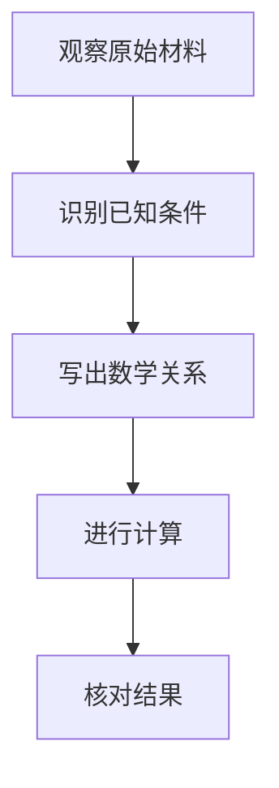

# 从差商到导数

取函数 f(x)=x²。先比较相邻两点的函数值，再让间隔趋近于零。下面把计算和解释放在一起，保留足够的阅读空间。

## 逐步推导

\[
\begin{aligned}
\frac{f(x+h)-f(x)}{h} &= \frac{(x+h)^2-x^2}{h} \\
&= 2x+h \\
f'(x)&=\lim_{h\to0}(2x+h)=2x
\end{aligned}
\]

先展开并约去 h，再取极限；h 在约分之前不能直接取零。

## 核心关系


## 自查

- 区分平均变化率与瞬时变化率。
- 检查定义域与约分的条件。

> 结论：平方函数在 x 处的导数为 2x。

## 很长的公式

\[S=x_1+x_2+x_3+x_4+x_5+x_6+x_7+x_8+x_9+x_{10}+x_{11}+x_{12}+x_{13}+x_{14}+x_{15}+x_{16}+x_{17}+x_{18}\]

公式应完整显示，仍可打开源文本编辑。

## 纵向过程



## 代码里的空行

```python
def square(x):
    return x * x

assert square(3) == 9
```
